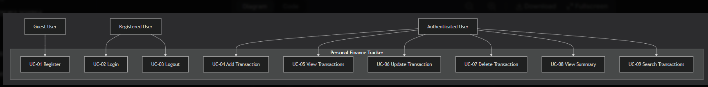

# Personal Finance Tracker - Use Cases

## Use Case Diagram

---

## Use Case Details

### UC-01: Register

| Field | Details |
|-------|---------|
| **Use Case ID** | UC-01 |
| **Use Case Name** | Register |
| **Actor** | Guest User |
| **Description** | New user creates an account to access the application |
| **Preconditions** | User is not registered |
| **Post Conditions** | Account created; user can login |
| **Primary Flow** | 1. User opens registration page 2. User enters username 3. User enters password 4. User confirms password 5. User clicks "Register" button 6. System validates all inputs 7. System creates new user account 8. System displays success message |
| **Alternative Flow** | A1. Username already exists → system displays error message A2. Passwords do not match → system displays error message A3. Password is less than 4 characters → system displays error message |
| **Business Rules** | - Username must be unique - Password must be at least 4 characters - Password and Confirm Password must match |
| **Related FR** | FR-001, FR-002, FR-003 |
| **Related User Story** | US-001 |

---

### UC-02: Login

| Field | Details |
|-------|---------|
| **Use Case ID** | UC-02 |
| **Use Case Name** | Login |
| **Actor** | Registered User |
| **Description** | Registered user logs in to access the dashboard |
| **Preconditions** | Account exists and is active |
| **Post Conditions** | User is authenticated; dashboard is displayed |
| **Primary Flow** | 1. User enters username 2. User enters password 3. User clicks "Login" button 4. System validates credentials 5. System authenticates user 6. User is redirected to dashboard |
| **Alternative Flow** | A1. Invalid username or password → system displays error message |
| **Business Rules** | - Username and password must match - User must be registered |
| **Related FR** | FR-004, FR-005 |
| **Related User Story** | US-002 |

---

### UC-03: Logout

| Field | Details |
|-------|---------|
| **Use Case ID** | UC-03 |
| **Use Case Name** | Logout |
| **Actor** | Authenticated User |
| **Description** | User logs out of the application |
| **Preconditions** | User is logged in |
| **Post Conditions** | User is logged out; session is terminated |
| **Primary Flow** | 1. User clicks "Logout" button 2. System ends the session 3. User is redirected to login page |
| **Alternative Flow** | None |
| **Business Rules** | - Session must be active |
| **Related FR** | FR-006 |
| **Related User Story** | US-003 |

---

### UC-04: Add Transaction

| Field | Details |
|-------|---------|
| **Use Case ID** | UC-04 |
| **Use Case Name** | Add Transaction |
| **Actor** | Authenticated User |
| **Description** | User adds a new income or expense transaction |
| **Preconditions** | User is logged in |
| **Post Conditions** | Transaction is saved; list and summary are updated |
| **Primary Flow** | 1. User enters description 2. User enters amount 3. User selects type (Income/Expense) 4. User clicks "Add" button 5. System validates input 6. System saves transaction to database 7. System refreshes transaction list 8. System updates summary (Income, Expense, Balance) |
| **Alternative Flow** | A1. Description is empty → system displays validation error A2. Amount is empty → system displays validation error |
| **Business Rules** | - Description is required - Amount must be a positive number - Type must be "Income" or "Expense" |
| **Related FR** | FR-008, FR-009 |
| **Related User Story** | US-004 |

---

### UC-05: View Transactions

| Field | Details |
|-------|---------|
| **Use Case ID** | UC-05 |
| **Use Case Name** | View Transactions |
| **Actor** | Authenticated User |
| **Description** | User views all their transactions in a list |
| **Preconditions** | User is logged in |
| **Post Conditions** | Transaction list is displayed |
| **Primary Flow** | 1. User navigates to dashboard 2. System fetches all transactions for the user 3. System displays transactions in a list 4. Each transaction shows: description, amount, type, date, Edit button (✏️), Delete button (🗑️) |
| **Alternative Flow** | A1. No transactions found → system displays "No transactions yet" message |
| **Business Rules** | - Only user's own transactions are shown |
| **Related FR** | FR-010 |
| **Related User Story** | US-005 |

---

### UC-06: Update Transaction

| Field | Details |
|-------|---------|
| **Use Case ID** | UC-06 |
| **Use Case Name** | Update Transaction |
| **Actor** | Authenticated User |
| **Description** | User edits an existing transaction |
| **Preconditions** | User is logged in; transaction exists |
| **Post Conditions** | Transaction is updated; list and summary are refreshed |
| **Primary Flow** | 1. User clicks Edit button (✏️) on a transaction 2. System opens Edit Modal 3. Modal shows pre-filled data (description, amount, type) 4. User modifies description, amount, or type 5. User clicks "Save" button 6. System validates input 7. System sends PUT request to backend 8. System updates transaction in database 9. System refreshes transaction list 10. System updates summary (Income, Expense, Balance) 11. System closes modal |
| **Alternative Flow** | A1. Description is empty → system displays validation error A2. Amount is empty → system displays validation error A3. Transaction not found → system displays error message |
| **Business Rules** | - Description is required - Amount must be a positive number - Type must be "Income" or "Expense" |
| **Related FR** | FR-011 |
| **Related User Story** | US-006 |

---

### UC-07: Delete Transaction

| Field | Details |
|-------|---------|
| **Use Case ID** | UC-07 |
| **Use Case Name** | Delete Transaction |
| **Actor** | Authenticated User |
| **Description** | User deletes an existing transaction |
| **Preconditions** | User is logged in; transaction exists |
| **Post Conditions** | Transaction is deleted; list and summary are updated |
| **Primary Flow** | 1. User clicks Delete button (🗑️) on a transaction 2. System deletes transaction from database 3. System refreshes transaction list 4. System updates summary (Income, Expense, Balance) |
| **Alternative Flow** | None |
| **Business Rules** | - Transaction must exist |
| **Related FR** | FR-012 |
| **Related User Story** | US-007 |

---

### UC-08: View Summary

| Field | Details |
|-------|---------|
| **Use Case ID** | UC-08 |
| **Use Case Name** | View Summary |
| **Actor** | Authenticated User |
| **Description** | User views financial summary |
| **Preconditions** | User is logged in |
| **Post Conditions** | Summary is displayed |
| **Primary Flow** | 1. User navigates to dashboard 2. System calculates total income from all income transactions 3. System calculates total expense from all expense transactions 4. System calculates balance (Total Income - Total Expense) 5. System displays: Total Income, Total Expense, Balance 6. Balance is shown in green if positive, red if negative |
| **Alternative Flow** | A1. No transactions → summary shows 0.00 |
| **Business Rules** | - Balance = Total Income - Total Expense - Positive balance = green color - Negative balance = red color |
| **Related FR** | FR-013, FR-014, FR-015, FR-016, FR-017 |
| **Related User Story** | US-008 |

---

### UC-09: Search Transactions

| Field | Details |
|-------|---------|
| **Use Case ID** | UC-09 |
| **Use Case Name** | Search Transactions |
| **Actor** | Authenticated User |
| **Description** | User searches transactions by description |
| **Preconditions** | User is logged in |
| **Post Conditions** | Filtered transaction list is displayed |
| **Primary Flow** | 1. User types keyword in search box 2. System filters transactions by description (case-insensitive) 3. System displays matching transactions 4. User can clear search by clicking ✕ button |
| **Alternative Flow** | A1. No matching transactions → system displays "No transaction found for '{keyword}'" message |
| **Business Rules** | - Search is case-insensitive - Only transactions matching the keyword are shown |
| **Related FR** | FR-018, FR-019, FR-020 |
| **Related User Story** | US-009 |

---

## Use Case Summary Table

| UC ID | Use Case | Actor | Priority | Status |
|-------|----------|-------|----------|--------|
| UC-01 | Register | Guest User | High | ✅ Implemented |
| UC-02 | Login | Registered User | High | ✅ Implemented |
| UC-03 | Logout | Authenticated User | High | ✅ Implemented |
| UC-04 | Add Transaction | Authenticated User | High | ✅ Implemented |
| UC-05 | View Transactions | Authenticated User | High | ✅ Implemented |
| UC-06 | Update Transaction | Authenticated User | High | ✅ Implemented |
| UC-07 | Delete Transaction | Authenticated User | High | ✅ Implemented |
| UC-08 | View Summary | Authenticated User | High | ✅ Implemented |
| UC-09 | Search Transactions | Authenticated User | Medium | ✅ Implemented |