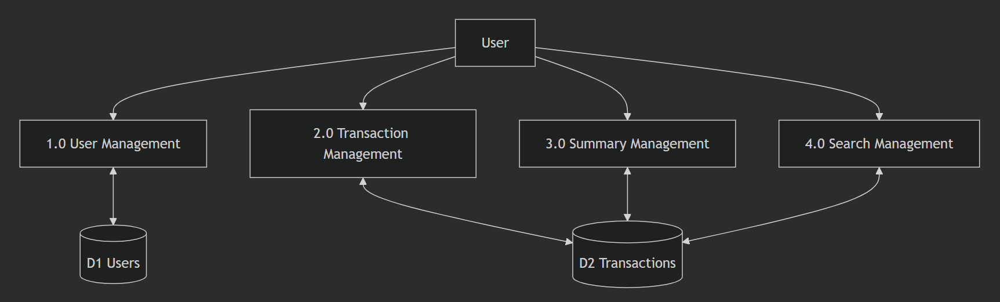
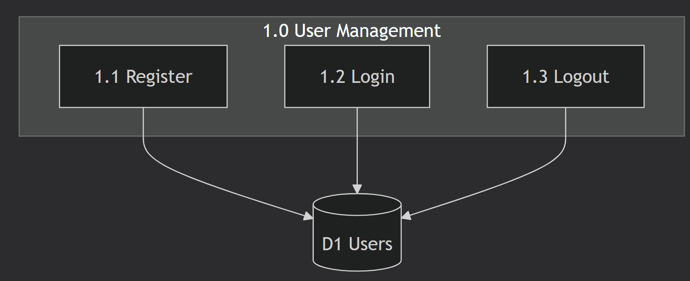
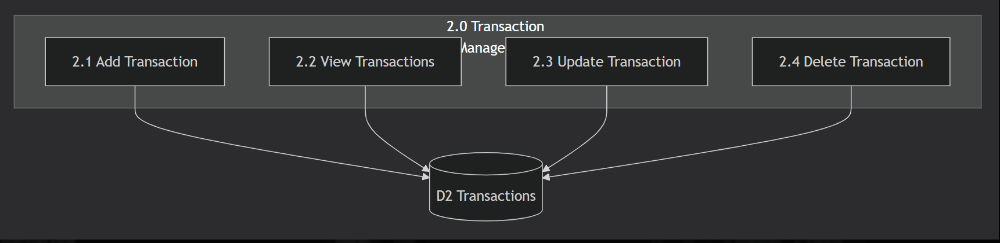
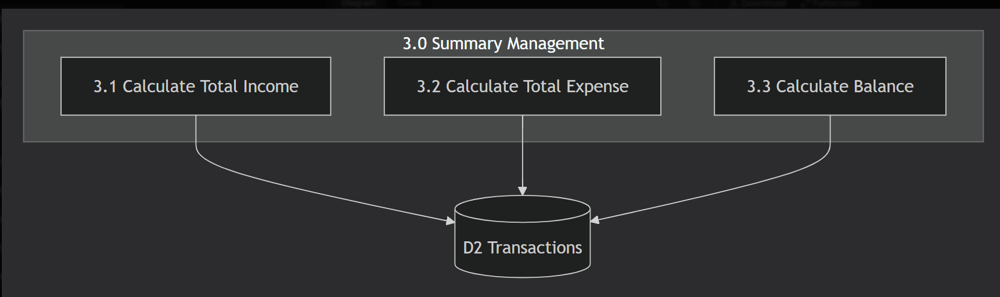
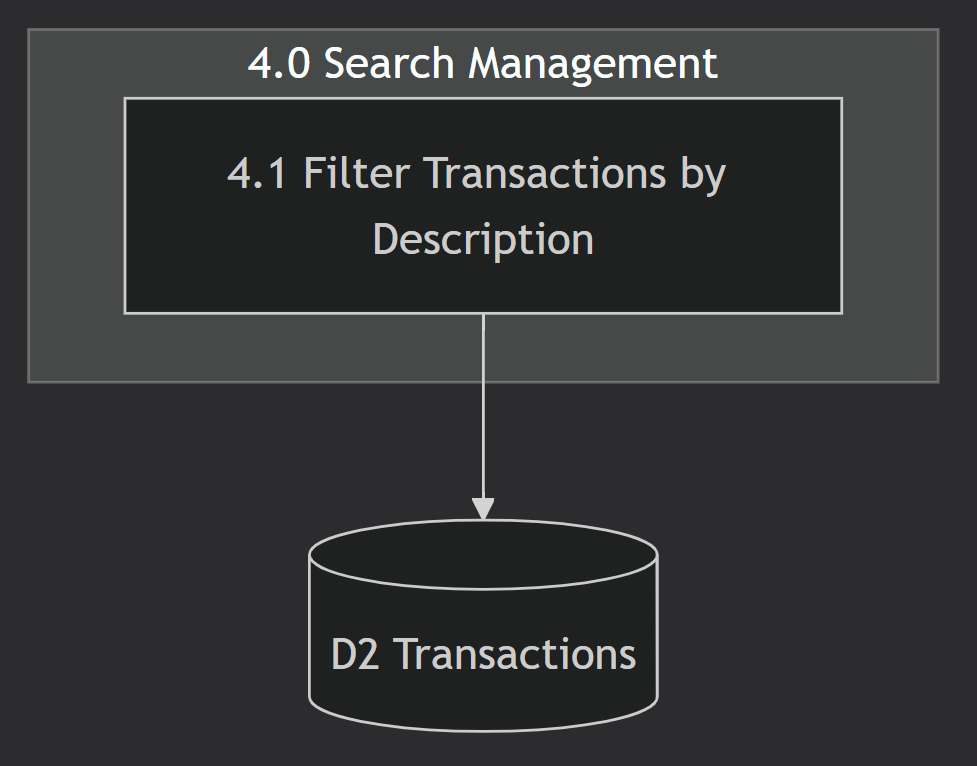

# Personal Finance Tracker - Data Flow Diagrams (DFD)

## Context Diagram (Level 0)

## Level 1 DFD - Main Processes

## Level 2 DFD - Process Decomposition

### 1.0 User Management

### 2.0 Transaction Management

### 3.0 Summary Management

---

## Data Flow Descriptions

### Flow 1: User Registration
User → Registration Data → System → Save → Database
Database → Success/Error → System → Message → User

### Flow 2: User Login
User → Login Credentials → System → Validate → Database
Database → User Data → System → Dashboard → User

### Flow 3: Add Transaction
User → Transaction Data → System → Save → Database
Database → Confirmation → System → Updated List → User

### Flow 4: View Transactions
User → Request → System → Query → Database
Database → Transaction Data → System → List → User

### Flow 5: Update Transaction
User → Updated Data → System → Update → Database
Database → Confirmation → System → Updated List → User

### Flow 6: Delete Transaction
User → Delete Request → System → Delete → Database
Database → Confirmation → System → Updated List → User

### Flow 7: View Summary
User → Request → System → Query → Database
Database → Summary Data → System → Summary → User

### Flow 8: Search Transactions
User → Search Keyword → System → Filter → Database
Database → Filtered Data → System → Filtered List → User

---

## Data Stores

| Data Store | Description | Tables |
|------------|-------------|--------|
| D1 | User Information | users (id, username, password) |
| D2 | Transaction Records | transactions (id, user_id, description, amount, type, date) |

---

## DFD Summary Table

| Process ID | Process Name | Input | Output | Data Store |
|------------|--------------|-------|--------|------------|
| 1.0 | User Management | Registration/Login Data | Success/Error Message | D1 |
| 2.0 | Transaction Management | Transaction Data | Updated List | D2 |
| 3.0 | Summary Management | user_id | Total Income, Expense, Balance | D2 |
| 4.0 | Search Management | Search Keyword | Filtered List | D2 |